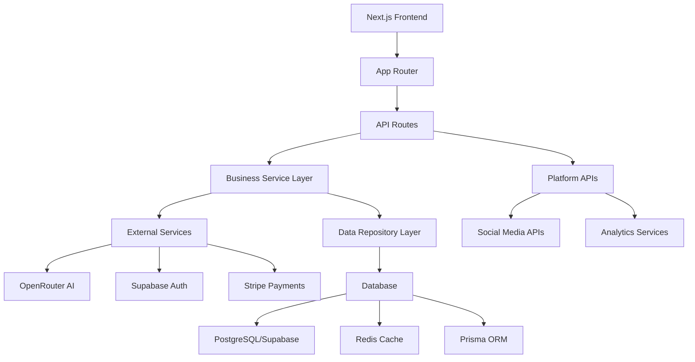

# SYNTHEX - AI-Powered Social Media Automation Platform

<div align="center">


[](https://vercel.com/new/clone?repository-url=https://github.com/CleanExpo/Synthex)
[](https://github.com/CleanExpo/Synthex)
[](https://nextjs.org)
[](https://www.typescriptlang.org/)
[](https://opensource.org/licenses/MIT)
[](https://nodejs.org)

**Transform Your Social Media Presence with AI-Driven Automation**

[Live Demo](https://synthex.vercel.app) | [Documentation](./docs) | [API Reference](#-api-documentation) | [Quick Start](#-quick-start)

</div>

---

## 🌟 Overview

SYNTHEX is a cutting-edge marketing automation platform built with Next.js 14 that combines the power of multiple AI technologies to revolutionize how businesses create, optimize, and deploy marketing content across all major social media platforms.

### 🎯 Why SYNTHEX?

- **🚀 10x Faster Content Creation** - Generate platform-optimized content in seconds
- **🧠 AI-Powered Intelligence** - Leverage GPT-4, Claude, and 50+ AI models via OpenRouter
- **📊 Predictive Analytics** - Know what works before you post
- **🔬 Scientific Approach** - Google's MLE Star framework ensures quality
- **⚡ Modern Stack** - Next.js 14 App Router with React Server Components
- **🌐 Multi-Platform Mastery** - Optimize for Twitter, LinkedIn, Instagram, Facebook, YouTube, TikTok, Pinterest, and Reddit

## ✨ Tech Stack

### Core Technologies

<table>
<tr>
<td width="50%">

**Frontend & Framework**
- Next.js 14.2.31 (App Router)
- React 18 with Server Components
- TypeScript 5.3
- Tailwind CSS for styling
- Framer Motion for animations

</td>
<td width="50%">

**Backend & Database**
- Supabase (Auth & Database)
- Prisma ORM
- PostgreSQL
- Redis for caching
- Stripe for payments

</td>
</tr>
</table>

### AI & Integrations

<table>
<tr>
<td width="50%">

**AI Models & Services**
- OpenRouter (50+ AI models)
- Anthropic Claude 3
- GPT-4 and GPT-4 Turbo
- Google Gemini
- Sequential Thinking (MCP)

</td>
<td width="50%">

**Platform Integrations**
- Twitter/X API
- LinkedIn API
- Instagram Graph API
- Facebook Marketing API
- YouTube Data API
- TikTok API
- Pinterest API
- Reddit API

</td>
</tr>
</table>

## 🚀 Quick Start

### Prerequisites

- Node.js >= 18.17.0
- npm or yarn
- PostgreSQL database (or Supabase account)
- API keys from required services

### Installation

```bash
# Clone the repository
git clone https://github.com/CleanExpo/Synthex.git
cd Synthex

# Install dependencies
npm install

# Set up environment variables
cp .env.example .env.local
# Edit .env.local and add your API keys

# Generate Prisma client
npx prisma generate

# Run database migrations
npx prisma migrate dev

# Start development server
npm run dev

# Or build for production
npm run build:vercel
npm run start
```

### 🔑 Environment Setup

Create a `.env.local` file with your API keys:

```env
# Database (Supabase)
DATABASE_URL=postgresql://[user]:[password]@[host]:[port]/[database]
POSTGRES_URL_NON_POOLING=postgresql://[user]:[password]@[host]:[port]/[database]
DIRECT_URL=postgresql://[user]:[password]@[host]:[port]/[database]

# Supabase
NEXT_PUBLIC_SUPABASE_URL=your_supabase_url
NEXT_PUBLIC_SUPABASE_ANON_KEY=your_supabase_anon_key
SUPABASE_SERVICE_ROLE_KEY=your_service_role_key

# Authentication
JWT_SECRET=your_jwt_secret_here
NEXTAUTH_SECRET=your_nextauth_secret
NEXTAUTH_URL=http://localhost:3000

# AI Services
ANTHROPIC_API_KEY=your_anthropic_api_key
OPENROUTER_API_KEY=your_openrouter_api_key

# Stripe
STRIPE_SECRET_KEY=your_stripe_secret_key
STRIPE_WEBHOOK_SECRET=your_webhook_secret
NEXT_PUBLIC_STRIPE_PUBLISHABLE_KEY=your_publishable_key

# Redis (Optional)
REDIS_URL=redis://localhost:6379
UPSTASH_REDIS_REST_URL=your_upstash_url
UPSTASH_REDIS_REST_TOKEN=your_upstash_token

# Google OAuth (Optional)
GOOGLE_CLIENT_ID=your_google_client_id
GOOGLE_CLIENT_SECRET=your_google_client_secret

# Server Configuration
NODE_ENV=development
PORT=3000

# MCP Configuration
MCP_SEQUENTIAL_THINKING_ENABLED=true
MCP_CONTEXT7_ENABLED=true
```

## 🏗️ Architecture

### Next.js 14 App Router Structure

```
Synthex/
├── app/                      # Next.js App Router
│   ├── (auth)/              # Authentication routes
│   │   ├── login/
│   │   └── register/
│   ├── api/                 # API routes
│   │   ├── openrouter/
│   │   ├── stripe/
│   │   └── auth/
│   ├── dashboard/           # Dashboard pages
│   │   ├── page.tsx
│   │   ├── admin/
│   │   ├── analytics/
│   │   ├── sandbox/
│   │   └── settings/
│   ├── layout.tsx          # Root layout
│   └── page.tsx            # Home page
├── components/              # React components
│   ├── ui/                 # UI components
│   ├── dashboard/
│   └── forms/
├── src/
│   ├── architecture/       # Three-tier architecture
│   ├── business/           # Business logic layer
│   │   └── services/
│   ├── data/              # Data access layer
│   │   └── repositories/
│   ├── config/            # Platform configurations
│   │   └── platforms/
│   ├── lib/               # Utilities and integrations
│   │   ├── ai/
│   │   ├── cache/
│   │   ├── prisma.ts
│   │   └── supabase/
│   ├── middleware/        # Next.js middleware
│   └── services/          # Service layer
├── prisma/
│   └── schema.prisma      # Database schema
├── public/                # Static assets
└── tests/                 # Test suites
```

### System Architecture



## 📚 API Routes

### Content Generation

#### Generate Marketing Content
```http
POST /api/openrouter/marketing/generate
Content-Type: application/json

{
  "platform": "twitter",
  "topic": "Product Launch",
  "tone": "professional",
  "targetAudience": "tech professionals"
}
```

#### Chat with AI
```http
POST /api/openrouter/chat
Content-Type: application/json

{
  "message": "Help me create a viral LinkedIn post",
  "context": "B2B software company"
}
```

### Analytics

#### Get Dashboard Stats
```http
GET /api/analytics/dashboard
```

#### Platform Metrics
```http
POST /api/analytics/platforms
Content-Type: application/json

{
  "platforms": ["twitter", "linkedin"],
  "dateRange": "last7days"
}
```

## 🧪 Testing

```bash
# Run all tests
npm test

# Run with coverage
npm run test:coverage

# Type checking
npm run typecheck

# Linting
npm run lint

# Format code
npm run format

# Playwright E2E tests
npm run test:e2e
```

## 🚀 Deployment

### Recent Deployment Updates (January 2025)

✅ **Fixed Issues:**
- Resolved build configuration errors that were suppressing compilation failures
- Fixed TypeScript type mismatches in three-tier architecture
- Corrected Prisma schema field inconsistencies
- Fixed method visibility issues in platform service classes
- Resolved all missing dependency errors
- Updated build scripts to properly surface errors

### Deploy to Vercel

[](https://vercel.com/new/clone?repository-url=https://github.com/CleanExpo/Synthex)

### Build Commands

```bash
# Development build
npm run dev

# Production build
npm run build:vercel

# Start production server
npm run start

# Check deployment status
./check-deployment-status.ps1  # Windows
./check-deployment.js           # Cross-platform
```

### Vercel Configuration

The project includes a `vercel.json` configuration file optimized for Next.js 14:

```json
{
  "framework": "nextjs",
  "buildCommand": "npm run build:vercel",
  "outputDirectory": ".next",
  "devCommand": "npm run dev"
}
```

## 📈 Recent Updates

### Version 2.0.1 (January 2025)
- 🔧 **Major Architecture Migration**: Migrated from Express.js to Next.js 14.2.31
- ✅ **Deployment Fixes**: Resolved 2-week deployment blocking issues
- 🏗️ **Three-Tier Architecture**: Implemented clean separation of concerns
- 🔐 **Enhanced Security**: Added Supabase authentication with JWT
- 💳 **Payment Integration**: Integrated Stripe for subscription management
- ⚡ **Performance**: Added Redis caching layer for improved response times
- 🎨 **Modern UI**: Rebuilt dashboard with React Server Components
- 📊 **Real-time Analytics**: Added live dashboard with WebSocket updates

### Coming Soon
- 🔄 Advanced A/B testing framework
- 📅 Smart content scheduling
- 🌍 Multi-language support
- 🎥 Video content generation
- 🤖 Custom AI model training

## 🛠️ Troubleshooting

### Common Issues

#### Build Errors
```bash
# Clear cache and rebuild
rm -rf .next node_modules
npm install
npm run build:vercel
```

#### Database Connection
```bash
# Test database connection
npx prisma db push

# Reset database (development only)
npx prisma migrate reset
```

#### Environment Variables
Ensure all required environment variables are set in `.env.local` for development or in your Vercel project settings for production.

## 🤝 Contributing

We welcome contributions! Please see our [Contributing Guide](CONTRIBUTING.md) for details.

```bash
# Fork the repository
# Create your feature branch
git checkout -b feature/AmazingFeature

# Commit your changes
git commit -m 'Add some AmazingFeature'

# Push to the branch
git push origin feature/AmazingFeature

# Open a Pull Request
```

## 📄 License

This project is licensed under the MIT License - see the [LICENSE](LICENSE) file for details.

## 🙏 Acknowledgments

- **Next.js Team** - For the amazing React framework
- **Vercel** - For hosting and deployment platform
- **Supabase** - For backend as a service
- **Anthropic** - For Claude AI integration
- **OpenRouter** - For multi-model AI access
- **Stripe** - For payment processing

## 💬 Support

- 📧 Email: support@synthex.dev
- 🐛 Issues: [GitHub Issues](https://github.com/CleanExpo/Synthex/issues)
- 📖 Docs: [Full Documentation](./docs)

---

<div align="center">

**Built with ❤️ by the SYNTHEX Team**

[Website](https://synthex.vercel.app) • [GitHub](https://github.com/CleanExpo/Synthex)

**If you find SYNTHEX useful, please ⭐ star this repository!**

</div>
