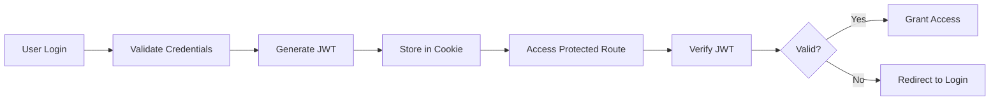

# 🎓 SYNTHEX Learning Path
## Complete Onboarding Guide for New Team Members

Welcome to SYNTHEX! This learning path will take you from zero to hero in understanding and contributing to our AI-powered marketing platform.

---

## 📚 Week 1: Foundation & Setup

### Day 1: Project Overview
**Learning Objectives:**
- Understand SYNTHEX's mission and architecture
- Set up development environment
- Make your first commit

#### 🎯 Quick Check
Can you explain what SYNTHEX does in one sentence?
> *Think about: Target users, core value proposition, key differentiator*

#### 📖 Required Reading
1. [README.md](../../README.md) - Project overview
2. [CLAUDE.md](../../CLAUDE.md) - Development guidelines
3. [Architecture Overview](#architecture-overview)

#### 💡 **Insight: Why Architecture Matters**
Understanding the system architecture isn't just about knowing where files go. It's about understanding data flow, decision patterns, and how changes in one area affect others. Think of it like understanding a city's layout before becoming a taxi driver.

#### 🛠️ Hands-On Exercise
```javascript
// TODO(human): Your first task! 
// Find the main entry point of our application
// Hint: Look in app/page.tsx
// Question: What renders first when a user visits SYNTHEX?
```

### Day 2: Development Workflow
**Learning Objectives:**
- Master Git workflow
- Understand our CI/CD pipeline
- Set up local development

#### Code Along: Setting Up Your Environment
```bash
# Step 1: Clone the repository
git clone [repository-url]
cd synthex

# 💡 Insight: We use npm for package management
# Why? Consistency, lock files, and better security auditing
npm install

# Step 2: Set up environment variables
cp .env.example .env.local
# TODO(human): Add your API keys to .env.local
# Reference: Ask team lead for development keys

# Step 3: Run development server
npm run dev

# 🎯 Quick Check: Open http://localhost:3000
# You should see the SYNTHEX landing page!
```

#### Common Pitfall Alert! ⚠️
```javascript
// ❌ DON'T commit .env files
// These contain secrets and should NEVER be in Git

// ✅ DO use environment variables
process.env.NEXT_PUBLIC_API_URL // Safe for client-side
process.env.SECRET_API_KEY      // Server-side only
```

### Day 3: Core Technologies
**Learning Objectives:**
- Understand Next.js App Router
- Learn TypeScript basics
- Explore Prisma ORM

#### 🎓 Interactive Learning: TypeScript
```typescript
// Let's understand TypeScript step by step!

// Level 1: Basic Types
type User = {
  id: string;
  email: string;
  role: 'admin' | 'user'; // Union type - user can only be one of these
};

// TODO(human): Create a Product type with:
// - id (string)
// - name (string) 
// - price (number)
// - inStock (boolean)

// Level 2: Generics (Don't worry if this seems complex!)
type APIResponse<T> = {
  data: T;
  error: string | null;
  timestamp: number;
};

// This allows us to reuse the response structure:
type UserResponse = APIResponse<User>;
type ProductResponse = APIResponse<Product>;

// 💡 Insight: TypeScript helps catch bugs before runtime
// Studies show it reduces bugs by 15-20% in large codebases!
```

### Day 4: Database & API
**Learning Objectives:**
- Understand Prisma schema
- Make API calls
- Handle async operations

#### Code Walkthrough: API Pattern
```javascript
// 📚 LEARNING POINT: Our API follows REST principles
// Let's trace a request from frontend to database

// 1️⃣ Frontend makes request
const fetchUserProfile = async () => {
  try {
    // TODO(human): What happens if this fails?
    // Hint: Check our error handling pattern
    const response = await fetch('/api/profile');
    const data = await response.json();
    return data;
  } catch (error) {
    // 💡 Insight: Always handle errors gracefully
    // Users should never see raw error messages
    console.error('Profile fetch failed:', error);
    return null;
  }
};

// 2️⃣ API Route handles request (app/api/profile/route.ts)
export async function GET(request: Request) {
  // Authentication check
  const session = await getSession();
  if (!session) {
    return new Response('Unauthorized', { status: 401 });
  }
  
  // Database query using Prisma
  const profile = await prisma.user.findUnique({
    where: { id: session.userId }
  });
  
  return Response.json(profile);
}

// 🎯 Quick Check: What status code means "Not Found"?
// Answer: 404 - memorize common HTTP status codes!
```

### Day 5: Frontend Components
**Learning Objectives:**
- Build React components
- Understand component composition
- Use our UI library

#### 🏗️ Build Your First Component
```jsx
// Let's build a feature card component together!

// Step 1: Plan the component
// What props does it need?
// - title: string
// - description: string
// - icon: ReactNode
// - onClick?: () => void

// TODO(human): Implement the FeatureCard component
// Start here:
export function FeatureCard({ title, description, icon, onClick }) {
  return (
    <div className="p-6 rounded-lg bg-white shadow-md">
      {/* Your implementation here */}
      {/* Hint: Look at similar components in components/ folder */}
    </div>
  );
}

// 💡 Insight: Component composition > inheritance
// We build complex UIs by combining simple components
// Like LEGO blocks! 🧱
```

---

## 📚 Week 2: Core Features

### Day 6: Authentication System
**Learning Objectives:**
- Understand JWT tokens
- Implement protected routes
- Handle user sessions

#### Deep Dive: Authentication Flow


#### Security Checkpoint 🔒
```javascript
// ⚠️ CRITICAL: Never store sensitive data in JWT
// JWTs are encoded, NOT encrypted!

// ❌ BAD - Exposing sensitive data
const token = jwt.sign({
  userId: user.id,
  password: user.password, // NEVER DO THIS!
  creditCard: user.ccNumber // NEVER DO THIS!
}, SECRET);

// ✅ GOOD - Only non-sensitive identifiers
const token = jwt.sign({
  userId: user.id,
  role: user.role,
  exp: Math.floor(Date.now() / 1000) + (60 * 60) // 1 hour
}, SECRET);

// TODO(human): Find our JWT implementation
// Question: How long do our tokens last?
// Hint: Check src/lib/auth/jwt.ts
```

### Day 7: AI Integration
**Learning Objectives:**
- Understand OpenRouter integration
- Create AI-powered features
- Handle streaming responses

#### 🤖 Working with AI APIs
```javascript
// 📚 LEARNING POINT: AI Integration Pattern
// We use OpenRouter as our AI gateway

async function generateMarketingHook(context) {
  // Step 1: Prepare the prompt
  // 💡 Insight: Good prompts = good outputs
  // Be specific, provide context, set constraints
  const prompt = `
    Generate a viral marketing hook for:
    Product: ${context.product}
    Target Audience: ${context.audience}
    Platform: ${context.platform}
    
    Requirements:
    - Maximum 280 characters (Twitter limit)
    - Include emotional trigger
    - End with call-to-action
  `;
  
  // Step 2: Call AI API
  const response = await openRouterAPI.complete({
    model: 'anthropic/claude-3-opus',
    messages: [{ role: 'user', content: prompt }],
    temperature: 0.7, // Balance creativity vs consistency
  });
  
  // TODO(human): Implement error handling
  // What if the API is down?
  // What if we hit rate limits?
  
  return response.choices[0].message.content;
}

// 🎯 Quick Check: What does temperature control?
// Answer: Randomness/creativity of outputs (0=deterministic, 1=creative)
```

### Day 8: Performance Optimization
**Learning Objectives:**
- Implement caching strategies
- Optimize database queries
- Improve load times

#### Performance Patterns
```javascript
// 📚 LEARNING POINT: Caching Strategies

// 1️⃣ Memory Cache (Fast, Limited)
const memoryCache = new Map();

function getCachedData(key) {
  if (memoryCache.has(key)) {
    // 💡 Insight: Memory cache is fastest but volatile
    // Lost on server restart!
    return memoryCache.get(key);
  }
  
  const data = fetchFromDatabase(key);
  memoryCache.set(key, data);
  return data;
}

// 2️⃣ Redis Cache (Fast, Persistent)
async function getRedisCachedData(key) {
  // Check Redis first
  const cached = await redis.get(key);
  if (cached) return JSON.parse(cached);
  
  // Fetch and cache
  const data = await fetchFromDatabase(key);
  await redis.set(key, JSON.stringify(data), 'EX', 3600); // 1 hour TTL
  
  return data;
}

// TODO(human): Find our caching implementation
// Question: What do we cache and for how long?
// Hint: Check src/lib/cache/
```

### Day 9: Testing Strategies
**Learning Objectives:**
- Write unit tests
- Create integration tests
- Understand TDD

#### Test-Driven Development Exercise
```javascript
// 📚 LEARNING POINT: Write tests FIRST!

// Step 1: Write the test
describe('ConversionOptimizer', () => {
  it('should calculate conversion rate correctly', () => {
    // TODO(human): Complete this test
    // Given: 1000 visitors, 30 conversions
    // Expected: 3% conversion rate
    
    const optimizer = new ConversionOptimizer();
    const rate = optimizer.calculateRate(1000, 30);
    expect(rate).toBe(0.03);
  });
});

// Step 2: Write minimal code to pass
class ConversionOptimizer {
  calculateRate(visitors, conversions) {
    // TODO(human): Implement this
    // Remember: Handle edge cases!
    // What if visitors is 0?
  }
}

// 💡 Insight: TDD helps you think about edge cases
// before they become production bugs!
```

### Day 10: Debugging & Monitoring
**Learning Objectives:**
- Use debugging tools effectively
- Set up error tracking
- Monitor performance

#### Debugging Masterclass
```javascript
// 🔍 Debugging Techniques

// 1️⃣ Console Methods Beyond console.log
console.table(data); // Display tabular data
console.time('api-call'); // Start timer
// ... code ...
console.timeEnd('api-call'); // End timer
console.trace(); // Show call stack

// 2️⃣ Debugger Statement
function problematicFunction(data) {
  debugger; // Execution stops here in DevTools
  // TODO(human): Try this in your browser!
  return processData(data);
}

// 3️⃣ Error Boundaries (React)
class ErrorBoundary extends React.Component {
  componentDidCatch(error, errorInfo) {
    // Log to error tracking service
    errorTracker.log(error, errorInfo);
    
    // 💡 Insight: Users should see friendly error messages
    // Not stack traces!
  }
}

// 🎯 Quick Check: What's the keyboard shortcut for DevTools?
// Answer: F12 or Cmd+Option+I (Mac) / Ctrl+Shift+I (Windows)
```

---

## 📚 Week 3: Advanced Features

### Day 11: Multi-Platform Optimization
**Learning Objectives:**
- Platform-specific requirements
- Content adaptation strategies
- API rate limiting

#### Platform Deep Dive
```javascript
// 📚 LEARNING POINT: Each platform has unique requirements

const platformOptimizer = {
  twitter: {
    maxLength: 280,
    mediaTypes: ['image', 'video', 'gif'],
    bestTimes: ['9am', '12pm', '5pm', '7pm'],
    
    optimize(content) {
      // TODO(human): Implement Twitter optimization
      // Consider: Hashtags, mentions, threads
      return {
        text: this.truncateSmartly(content.text, 280),
        media: this.optimizeMedia(content.media, 'twitter')
      };
    }
  },
  
  instagram: {
    maxLength: 2200,
    mediaTypes: ['image', 'video', 'reel'],
    aspectRatios: { feed: '1:1', story: '9:16', reel: '9:16' },
    
    optimize(content) {
      // 💡 Insight: Instagram is visual-first
      // Text is secondary to imagery
      return {
        caption: this.addHashtags(content.text, 30), // Max 30 hashtags
        media: this.cropForInstagram(content.media)
      };
    }
  },
  
  // TODO(human): Add LinkedIn optimization
  // Consider: Professional tone, longer form content
};

// 🎯 Quick Check: What's the ideal video length for TikTok?
// Answer: 15-60 seconds (shorter is often better!)
```

### Day 12: Analytics & Metrics
**Learning Objectives:**
- Implement tracking
- Analyze user behavior
- Create dashboards

#### Analytics Implementation
```javascript
// 📚 LEARNING POINT: Measure everything, but respect privacy

class AnalyticsTracker {
  // Track user events
  track(event, properties = {}) {
    // 💡 Insight: Include context for better analysis
    const enrichedEvent = {
      event,
      properties,
      context: {
        timestamp: Date.now(),
        sessionId: this.getSessionId(),
        platform: this.detectPlatform(),
        // TODO(human): What else should we track?
        // Hint: Think about debugging needs
      }
    };
    
    // Send to multiple analytics services
    this.sendToGA4(enrichedEvent);
    this.sendToMixpanel(enrichedEvent);
    this.sendToCustomBackend(enrichedEvent);
  }
  
  // Calculate key metrics
  calculateEngagementRate(interactions, impressions) {
    // TODO(human): Implement engagement rate calculation
    // Formula: (interactions / impressions) * 100
    // Consider: What counts as an interaction?
  }
  
  // 🎯 Quick Check: What's a good engagement rate?
  // Answer: 1-3% for most platforms, but context matters!
}
```

### Day 13: Security Best Practices
**Learning Objectives:**
- Prevent common vulnerabilities
- Implement security headers
- Handle sensitive data

#### Security Checklist
```javascript
// 🔒 SECURITY CRITICAL: Learn these patterns!

// 1️⃣ Input Validation - NEVER trust user input
function validateInput(input) {
  // Sanitize HTML to prevent XSS
  const cleaned = DOMPurify.sanitize(input);
  
  // Validate format
  if (!isValidFormat(cleaned)) {
    throw new ValidationError('Invalid input format');
  }
  
  // Check length limits
  if (cleaned.length > MAX_LENGTH) {
    throw new ValidationError('Input too long');
  }
  
  return cleaned;
}

// 2️⃣ SQL Injection Prevention
// ❌ NEVER do this - SQL Injection vulnerability!
const query = `SELECT * FROM users WHERE id = ${userId}`;

// ✅ Use parameterized queries (Prisma does this for us)
const user = await prisma.user.findUnique({
  where: { id: userId } // Automatically escaped
});

// 3️⃣ Rate Limiting
const rateLimiter = rateLimit({
  windowMs: 15 * 60 * 1000, // 15 minutes
  max: 100, // Max 100 requests per window
  message: 'Too many requests, please try again later'
});

// TODO(human): Find our security middleware
// Question: What security headers do we set?
// Hint: Check src/middleware/security.ts

// 💡 Insight: Security is everyone's responsibility
// Not just the security team's!
```

### Day 14: Deployment & DevOps
**Learning Objectives:**
- Understand CI/CD pipeline
- Deploy to production
- Monitor production issues

#### Deployment Workflow
```yaml
# 📚 LEARNING POINT: Our deployment pipeline

# .github/workflows/deploy.yml
name: Deploy to Production

on:
  push:
    branches: [main]

jobs:
  test:
    steps:
      - run: npm test
      # TODO(human): What happens if tests fail?
      
  build:
    needs: test
    steps:
      - run: npm run build
      # 💡 Insight: Build step catches TypeScript errors
      
  deploy:
    needs: build
    steps:
      - run: vercel --prod
      # 🎯 Quick Check: What's the deployment URL?
```

### Day 15: Code Review & Collaboration
**Learning Objectives:**
- Give constructive feedback
- Review code effectively
- Collaborate asynchronously

#### Code Review Best Practices
```javascript
// 📚 LEARNING POINT: How to review code

/*
 * GOOD Code Review Comment:
 * "Consider using useMemo here to prevent unnecessary recalculations.
 * Since userData rarely changes, we could optimize by:
 * const processedData = useMemo(() => processUserData(userData), [userData])
 * This would improve performance when the component re-renders."
 */

/*
 * BAD Code Review Comment:
 * "This is wrong. Fix it."
 * (No context, not helpful, discouraging)
 */

// TODO(human): Review this code and provide feedback
function calculateMetrics(data) {
  let total = 0;
  for (let i = 0; i < data.length; i++) {
    total = total + data[i].value;
  }
  const average = total / data.length;
  return { total: total, average: average };
}

// Consider: Performance, readability, edge cases, modern syntax
```

---

## 📚 Week 4: Specialization & Mastery

### Choose Your Specialization Path:

#### 🎯 Path A: Marketing Technology Specialist
- Advanced AI content generation
- Multi-platform automation
- Campaign optimization
- Growth hacking techniques

#### 🎨 Path B: UX/UI Specialist
- Advanced React patterns
- Animation and micro-interactions
- Accessibility expertise
- Design system development

#### 🔧 Path C: Backend Specialist
- Database optimization
- API design patterns
- Microservices architecture
- Performance tuning

#### 📊 Path D: Data & Analytics Specialist
- Machine learning integration
- Predictive analytics
- Data visualization
- A/B testing frameworks

---

## 🎓 Final Project

### Build a New Feature for SYNTHEX

**Requirements:**
1. Identify a user need through research
2. Design the solution (technical spec)
3. Implement with tests
4. Document your code
5. Deploy to staging
6. Present to the team

**Success Criteria:**
- [ ] Code passes all tests
- [ ] Feature is accessible (WCAG AA)
- [ ] Performance budget met (<3s load time)
- [ ] Documentation complete
- [ ] Code review approved

---

## 🏆 Graduation Checklist

### You're ready when you can:

- [ ] Explain SYNTHEX architecture to a new team member
- [ ] Debug production issues independently
- [ ] Write tests before code (TDD)
- [ ] Review PRs constructively
- [ ] Deploy to production confidently
- [ ] Mentor newer team members
- [ ] Contribute to architecture decisions
- [ ] Handle on-call incidents

---

## 📚 Continuous Learning Resources

### Internal Resources
- Weekly tech talks (Fridays 2pm)
- Pair programming sessions
- Architecture review meetings
- #learning Slack channel

### External Resources
- [Next.js Documentation](https://nextjs.org/docs)
- [TypeScript Handbook](https://www.typescriptlang.org/docs/)
- [React Patterns](https://reactpatterns.com/)
- [Web.dev](https://web.dev/) - Performance & best practices

### Recommended Books
1. "Clean Code" by Robert Martin
2. "Designing Data-Intensive Applications" by Martin Kleppmann
3. "Don't Make Me Think" by Steve Krug
4. "The Pragmatic Programmer" by Hunt & Thomas

---

## 🎉 Welcome to the Team!

Remember: Everyone was a beginner once. Ask questions, make mistakes, learn constantly, and help others along the way.

**Your Journey Starts Now! 🚀**

---

*Last Updated: 2024*
*Maintainer: SYNTHEX Education Team*
*Questions? Reach out in #onboarding*