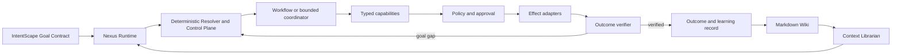

# Nexus Agentic Operating Model — Primary-Source Research

**Date:** 3 August 2026

**Status:** research record and architectural recommendation

**Scope:** Unite-Group Nexus, Synthex, IntentScape, internal projects, and client workspaces

## Research question

How should Unite-Group Nexus apply the supplied “AI-native company” transcript using the current capabilities and constraints of Claude Opus 5, Claude Sonnet 5, and OpenAI GPT-5.6 Sol, while reducing software-engineering bloat and improving verified outcomes?

## Source policy

- The supplied YouTube transcript is treated as `OPINION_SOURCE`.
- Model and platform claims use current first-party Anthropic and OpenAI documentation.
- Repository observations were checked against the current local Synthex worktree.
- Recommendations are synthesis, not vendor claims.

## Finding 1 — The transcript describes an operating system, not a model

The transcript's durable concepts are:

- skills as reusable job descriptions;
- a resolver as an organisational routing map;
- deterministic code for exact state and computation;
- models for interpretation, judgement and open-ended planning;
- a Markdown library plus a librarian for institutional context;
- an observe, decide, research, act and evaluate loop;
- capturing validated work so organisational capability compounds.

The productivity figures and company anecdotes are not used as architecture evidence. The practical thesis—that harness design matters at least as much as model selection—is consistent with current first-party guidance.

Anthropic distinguishes fixed workflows from agents that dynamically direct their own tool use. It recommends the simplest viable pattern and warns that agentic systems trade latency and cost for flexibility. It also says the most successful systems tend to use simple, composable patterns instead of opaque framework layers. [Building effective agents](https://www.anthropic.com/engineering/building-effective-agents)

OpenAI similarly recommends starting with one agent and adding specialists only when capability, policy, prompt clarity or trace legibility materially improve. Its Agents SDK distinguishes manager-style “agents as tools” from handoffs where a specialist takes ownership of the response. [Agents SDK](https://developers.openai.com/api/docs/guides/agents), [orchestration and handoffs](https://developers.openai.com/api/docs/guides/agents/orchestration)

## Finding 2 — Claude Opus 5 is real, powerful and still bounded

Anthropic documents Claude Opus 5 with API ID `claude-opus-5`. It has a 1M-token context window, 128k maximum synchronous output, adaptive thinking on by default, and an effort ladder from `low` through `max`. It is positioned for complex agentic coding and enterprise work. [Model overview](https://platform.claude.com/docs/en/about-claude/models/overview), [Opus 5 changes](https://platform.claude.com/docs/en/about-claude/models/whats-new-opus-5)

Important constraints:

- thinking cannot be disabled at `xhigh` or `max` effort;
- Web Fetch and Priority Tier are unavailable;
- fast mode is a research preview limited to the Claude API;
- larger effort requires more output room and consumes more time/tokens;
- Anthropic notes that Opus 5 delegates, narrates and self-verifies more readily, so legacy prompts that force those behaviours can create overwork;
- a 1M context window is still temporary request context, not durable company memory.

Implication for Nexus: use an Opus-class model for high-value ambiguity, long-horizon engineering and complex synthesis only after a value/risk gate. Do not make it the universal router, memory store or approval authority.

## Finding 3 — Claude Sonnet 5 is the workhorse but has migration traps

Anthropic documents Claude Sonnet 5 with API ID `claude-sonnet-5`. It has a 1M-token context window, 128k maximum synchronous output and adaptive thinking on by default. It is positioned as the speed/intelligence workhorse. [Sonnet 5 changes](https://platform.claude.com/docs/en/about-claude/models/whats-new-sonnet-5), [model overview](https://platform.claude.com/docs/en/about-claude/models/overview)

Important constraints:

- manual extended thinking with `budget_tokens` returns HTTP 400;
- non-default `temperature`, `top_p` or `top_k` returns HTTP 400;
- assistant-message prefilling is unsupported;
- Priority Tier is unavailable;
- equivalent text produces approximately 30% more tokens than on Sonnet 4.6, so older budgets and context estimates cannot be reused;
- high-risk cybersecurity refusals may arrive as HTTP 200 with `stop_reason: "refusal"` rather than as transport errors.

Implication for Nexus: provider adapters must be capability-aware and strip or reject unsupported parameters before dispatch. Cost, truncation and refusal handling need fresh evals before production migration.

## Finding 4 — GPT-5.6 Sol is a public API model, not only a Codex label

OpenAI documents `gpt-5.6-sol` as its frontier reasoning model for complex professional work. The `gpt-5.6` alias routes to Sol. Current documented limits are:

- 1,050,000-token context window;
- 922,000 maximum input;
- 128,000 maximum output;
- 16 February 2026 knowledge cutoff;
- text/image input and text output;
- Responses, Chat Completions and Batch endpoints;
- tools including web/file search, code interpreter, hosted shell, patching, skills, computer use, MCP and tool search.

[GPT-5.6 Sol model page](https://developers.openai.com/api/docs/models/gpt-5.6-sol)

Important constraints:

- prompts above 272k input tokens receive higher input and output pricing for the full request;
- the Responses output array can contain tool and reasoning items, so callers must not assume the first item is final text;
- instructions used on one response do not automatically persist when using `previous_response_id`;
- non-deterministic behaviour still requires pinned behaviour, fixtures, traces and evals;
- official prompting guidance still asks the harness to define roles, tools, testing, persistence, progress tracking and completion criteria.

[Prompt engineering](https://developers.openai.com/api/docs/guides/prompt-engineering), [agent evaluation](https://developers.openai.com/api/docs/guides/agent-evals)

Implication for Nexus: Sol can be a strong coordinator, engineering worker or independent reviewer, but it does not replace the control plane, curated wiki, permissions or outcome verifier.

## Finding 5 — Current Synthex bloat is competing ownership

A read-only scan of the current worktree found:

- 94 `SKILL.md` files;
- 18 agent specification files;
- 12 files named with `orchestrator` or `workflow`;
- 58 TypeScript files under `lib/ai`;
- 146 hard-coded Claude/GPT references, representing roughly 29 distinct strings.

The count is not automatically a problem. The problem is that several modules can independently choose models, prices, prompts, fallbacks, state and approval behaviour:

- `lib/ai/routing-config.ts`;
- `lib/ai/model-registry.ts`;
- `lib/ai/openrouter-client.ts`;
- `lib/ai/providers/*`;
- `lib/ai/boardroom.ts`;
- individual feature and domain orchestrators.

Current evidence of drift includes:

- the direct OpenAI provider still defaults to GPT-4o/4o-mini and uses Chat Completions;
- the Anthropic provider can forward sampling parameters Sonnet 5 rejects;
- model IDs and prices appear in feature code rather than one capability registry;
- domain orchestrators mix business logic, provider choice, persistence and control flow.

This raises upgrade cost and allows different projects to apply different safety, cost and completion rules.

## Architectural decision

Nexus should use **one deep runtime with several internal modules**, not a new framework per project.

### External interface

The first reusable Nexus interface should remain small:

- `runGoal(goalContract)`
- `inspectRun(runId)`
- `approveAction(runId, interruption)`
- `resumeRun(runId)`

Everything else—model routing, provider syntax, retries, context retrieval, worker dispatch and event storage—is implementation behind that interface.

### Existing foundations to keep

- `lib/intentscape/runtime.ts` for Context Field, Goal Contract and Work Packet intake;
- `lib/workflow/orchestrator.ts` as deterministic control-plane foundation;
- TypeScript, Zod, Prisma and BullMQ;
- existing evidence and approval gates;
- Markdown as the human-readable knowledge format;
- tested domain logic, moved behind capabilities rather than rewritten.

## Bloat-removal rules

1. **One model registry.** Product code asks for `fast`, `workhorse`, `frontier` or `independent-review`; only the registry knows vendor IDs, capabilities, accepted parameters, price and retirement status.
2. **One provider seam.** OpenAI Responses and Anthropic Messages are adapters behind the same typed model interface.
3. **One control plane.** Domain orchestrators become workflow definitions or handlers behind the existing deterministic engine.
4. **One run contract.** Goal Contract → Work Packet → transitions → verified outcome.
5. **One event vocabulary.** Record plan, task, model call, tool proposal, approval, effect, verification and learning.
6. **One capability registry.** Every skill has a job, owner, version, permissions, fixtures, evals, usage and retirement state.
7. **No automatic skill trust.** A successful run creates a candidate skill. Promotion requires a verified outcome plus either a second successful trial or explicit owner approval.
8. **No framework without evidence.** Add no new agent framework unless the existing TypeScript control plane fails a measured requirement.
9. **No transcript-as-state.** Conversation text may be evidence, but structured run state and append-only events drive recovery.
10. **No whole-wiki prompts.** The librarian returns task-specific, source-cited Context Packs with freshness and conflict checks.

## Delivery recommendation

The smallest safe implementation slice is:

> Create the canonical Nexus Model/Capability Registry and connect one IntentScape Work Packet to the existing deterministic workflow engine through the four-method Nexus runtime interface.

This should happen before migrating all projects or adding more agents.

### Acceptance evidence

- one Marketing Extender goal enters as an IntentScape Goal Contract;
- one Nexus run persists a versioned plan and task state;
- model selection comes only from the canonical registry;
- at least one tool/effect pauses at the correct approval gate;
- verification checks the observed result against the Goal Contract;
- the complete trace reports cost, tokens, retries, approvals and outcome;
- no new orchestrator framework or duplicated runtime is introduced.

## Uncertainties and required live checks

- Official model documentation proves the API models and limits, not whether every third-party interface with the same display name routes to that exact endpoint.
- Synthex production credentials and provider access were not exercised in this docs-only research.
- Model quality and unit economics must be measured on Nexus fixtures; vendor benchmarks cannot establish client-specific fitness.
- The static inventory is a point-in-time count and needs a semantic skill/agent ownership audit before deletion.
- Cross-project ownership of the eventual Nexus runtime must be decided before packages move; this research does not authorise a multi-repository refactor.
